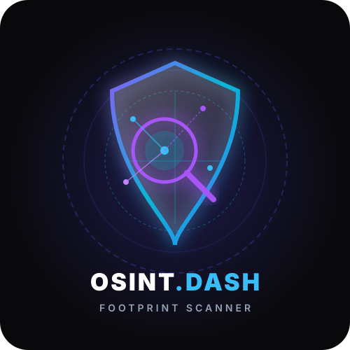

<div align="center">

  

  # 🔍 Personal Digital Footprint & OSINT Dashboard

  **An Open-Source Intelligence & Digital Footprint Reconnaissance Web Application**

  [](https://www.python.org/)
  [](https://fastapi.tiangolo.com/)
  [](https://tailwindcss.com/)
  [](LICENSE)
  [](#-educational--learning-purpose)

</div>

---

> [!IMPORTANT]
> ### 🎓 Educational & Learning Purpose
> This repository was designed and developed strictly for **educational, learning, and personal digital footprint awareness purposes**. It aims to demonstrate full-stack web development techniques using FastAPI, asynchronous Python network requests, API integrations, and modern UI design principles. 
>
> **Do not use this software for unauthorized surveillance, stalking, credential harvesting, or any illicit activities.** Respect personal privacy and comply with all applicable local, national, and international cybersecurity laws.

---

## 📌 Overview

The **Personal Digital Footprint & OSINT Dashboard** is a web-based reconnaissance tool that allows individuals to audit their online presence. By entering an email address or phone number, users can scan publicly available data sources and APIs to discover metadata, data breach leaks, and linked accounts.

Designed with a modern **Dark Glassmorphism UI**, the dashboard provides instant visual feedback, risk counts, and downloadable JSON report exports.

---

## ✨ Key Features

### 📱 Phone Intelligence Module
- **Validation & Parsing**: Powered by Google's `phonenumbers` library for E.164 standardization, international formatting, and country identification.
- **Carrier & Line Type**: Identifies network carrier names, line types (*Mobile*, *Fixed Line*, *VoIP*), and geographical timezones.
- **Account Enumeration**: Integrated check with `ignorant` to detect platform registrations.
- **Enrichment**: Optional support for `Numverify` API carrier lookup.

### 📧 Email Intelligence & Leak Check Module
- **Structure Analysis**: Parses username, domain name, and categorizes email service providers (e.g. Gmail, Outlook, ProtonMail).
- **Data Breach Lookup**: Integrated with **XposedOrNot** public REST API to fetch compromised database records, data exposure types, and breach dates without requiring mandatory paid keys.
- **Platform Registration**: Integrates `holehe` for detecting account existence across major online platforms.
- **Optional HIBP & LeakCheck Integration**: Modular architecture supporting HaveIBeenPwned API keys via environment configuration.

### 💻 User Interface & Reporting
- **Dark Glassmorphism Design**: Responsive UI styled with Tailwind CSS, animated glow elements, and dynamic cards.
- **Live Mode Toggle**: Seamless switching between Email and Phone search modes.
- **JSON Report Export**: Export detailed scan results with a single click for auditing.
- **Resilient Error Handling**: Handles network timeouts and invalid inputs gracefully with toast notifications.

---

## 🛠️ Technology Stack

- **Backend Framework**: [FastAPI](https://fastapi.tiangolo.com/) (Python 3.10+)
- **Server**: [Uvicorn](https://www.uvicorn.org/) (ASGI Server)
- **Validation & Parsing**: `phonenumbers` (Google Libphonenumber wrapper)
- **OSINT Wrappers**: `holehe`, `ignorant`
- **HTTP Client**: `httpx` (Async HTTP)
- **Frontend**: HTML5, Vanilla JavaScript (ES6+), Tailwind CSS (v3 CDN)
- **Breach API**: [XposedOrNot](https://xposedornot.com/) Free Public API

---

## 🚀 Quickstart Guide

### Prerequisites
Make sure you have **Python 3.10+** and **Git** installed on your system.

### 1. Clone the Repository
```bash
git clone https://github.com/abhicodesblindly/OSINT-Dashboard.git
cd OSINT-Dashboard
```

### 2. Create and Activate Virtual Environment
- **On Windows (PowerShell)**:
  ```powershell
  python -m venv venv
  .\venv\Scripts\activate
  ```
- **On Linux / macOS**:
  ```bash
  python3 -m venv venv
  source venv/bin/activate
  ```

### 3. Install Dependencies
```bash
pip install -r requirements.txt
pip install holehe ignorant
```

### 4. Configure Environment (Optional)
Create a `.env` file in the project root if you wish to use optional API keys:
```env
LEAKCHECK_API_KEY=
HIBP_API_KEY=
NUMVERIFY_API_KEY=
```

### 5. Launch the Dashboard
```bash
uvicorn main:app --host 0.0.0.0 --port 8000 --reload
```

Open your browser and navigate to: **`http://localhost:8000`** 🎉

---

## 🔌 API Endpoints

### 1. Phone Scan
- **Endpoint**: `POST /api/scan-phone`
- **Request Body**:
  ```json
  {
    "phone": "+14155552671"
  }
  ```
- **Response**: Returns parsed format, country, carrier, line type, timezones, and registered accounts.

### 2. Email Scan
- **Endpoint**: `POST /api/scan-email`
- **Request Body**:
  ```json
  {
    "email": "user@example.com"
  }
  ```
- **Response**: Returns email metadata, list of compromised data breach leaks, and linked accounts.

---

## 📁 Project Structure

```
OSINT-Dashboard/
├── main.py                       # FastAPI entry point & API routes
├── requirements.txt              # Dependency specifications
├── .env                          # Configuration & keys (git-ignored)
├── .gitignore                    # Git ignore file
├── README.md                     # Documentation & setup instructions
├── modules/
│   ├── __init__.py
│   ├── phone_scanner.py          # Phone parsing & OSINT logic
│   ├── email_scanner.py          # Email metadata, breach & account logic
│   └── utils.py                  # Standardized response & HTTP helpers
├── static/
│   ├── logo.svg                  # Project SVG Logo
│   └── js/
│       └── app.js                # Frontend application logic
└── templates/
    └── index.html                # Single-page Glassmorphism UI
```

---

## 🛡️ Disclaimer

This software is provided "as-is" strictly for **educational, security research, and personal privacy auditing purposes**. The author (`abhicodesblindly`) assumes no liability and is not responsible for any misuse, unlawful behavior, or damage caused by this application. Users are solely responsible for ensuring compliance with all local laws and terms of service of queried APIs.

---

## 📄 License

Distributed under the **MIT License**. See `LICENSE` for details.

---

<div align="center">
  <sub>Built for educational & security awareness research by <a href="https://github.com/abhicodesblindly">abhicodesblindly</a></sub>
</div>
